# 🚌 RouteGo — Semana 6

App móvil construida con **Expo SDK 54** y **Expo Router** para consultar rutas de transporte, ver un mapa con paradas y pedidos en curso, y demostrar el manejo correcto de **permisos nativos** (cámara, ubicación) y del **acelerómetro** mediante *custom hooks* tipados.

> Los datos de demostración del mapa están ubicados en **Riohacha, La Guajira (Colombia)**.

**Repositorio:** https://github.com/LuisCardona29/Semana-6-DM

---

## 📑 Tabla de contenidos

1. [Características](#-características)
2. [Custom hooks](#-custom-hooks)
3. [Manejo de permisos](#-manejo-de-permisos)
4. [Evidencia visual](#-evidencia-visual)
5. [Checklist de verificación](#-checklist-de-verificación)
6. [Estructura del proyecto](#-estructura-del-proyecto)
7. [Cómo ejecutar](#-cómo-ejecutar)
8. [Tecnologías](#-tecnologías)
9. [Documentación de IA](#-documentación-de-ia)

---

## ✨ Características

| Pantalla | Qué hace |
|---|---|
| **Inicio** | Muestra el estado del servicio y los shuttles en ruta con su ETA y estado (*En tránsito*, *Listo*, *A tiempo*). |
| **Rutas** | Buscador de corredores, listado de líneas (*Operativa* / *Mantenimiento*), mapa nativo con calles, paradas y recorrido destacado, y botón **Ver detalles** hacia `student/[id]`. |
| **Mi pase** | Pase digital, panel de **permisos del dispositivo**, vista previa de cámara y **sensor de movimiento** (contador de sacudidas). |

### Mapa y pedidos en curso

- Mapa nativo con paradas, recorrido principal y botón de centrar ubicación.
- Pedidos activos con marcador, ETA y estado: `En camino`, `Listo` y `Demorado`.
- Coordenadas reales del usuario (`Lat / Lon`) cuando el GPS está activo.

### Correcciones realizadas

- La pestaña **Rutas** ahora funciona: permite buscar recorridos y abrir **Ver detalles**.
- El detalle de cada ruta navega a `student/[id]`.
- El GPS se solicita desde **Activar GPS**, **nunca al abrir la app**.
- Al conceder ubicación se muestran las coordenadas actuales.
- Si el permiso está bloqueado aparece **Abrir Ajustes**.
- La cámara sigue funcionando aunque la ubicación sea rechazada.
- GPS y acelerómetro limpian sus suscripciones al salir de la pantalla.

---

## 🪝 Custom hooks

Toda la lógica nativa vive en `hooks/`, separada de la UI. Los hooks están **tipados (sin `any`)** y exponen los errores como **estado** para que la interfaz los muestre.

| Hook | Responsabilidad |
|---|---|
| [`hooks/useGeoLocation.ts`](hooks/useGeoLocation.ts) | Permiso de ubicación, coordenadas actuales, errores y *watcher* GPS con limpieza al desmontar. |
| [`hooks/useCamera.ts`](hooks/useCamera.ts) | Permiso de cámara, estados (concedido / rechazado / bloqueado) y acceso a Ajustes. |
| [`hooks/useShake.ts`](hooks/useShake.ts) | Detección de sacudidas con el acelerómetro y cancelación de la suscripción del sensor. |

### Buenas prácticas aplicadas

- **Permisos en contexto:** se piden solo cuando el usuario toca un botón (*Activar GPS*, *Solicitar permisos*).
- **Limpieza de suscripciones:** `remove()` / `unsubscribe` dentro del `return` de `useEffect`.
- **Errores como estado:** la UI nunca depende de `try/catch` aislados; lee el estado del hook.
- **Independencia entre permisos:** rechazar la ubicación no afecta a la cámara.

---

## 🔐 Manejo de permisos

La app distingue tres estados y muestra una respuesta distinta para cada uno:

| Estado | Comportamiento en la UI |
|---|---|
| ✅ **Concedido** | Se activa la función (coordenadas GPS, vista previa de cámara) y se muestra *"Los permisos están listos para usar la app"*. |
| ⚠️ **Rechazado** | Se informa al usuario, se permite volver a pedir con **Solicitar permisos** y el resto de la app (cámara) sigue funcionando. |
| 🚫 **Bloqueado** | Se explica que el permiso está bloqueado y aparece el botón **Abrir Ajustes** para habilitarlo manualmente. |

### Flujo de solicitud

```
Usuario toca "Activar GPS"  ──►  Diálogo nativo de Android
                                   ├─ Mientras la app está en uso / Solo esta vez ──► Concedido
                                   ├─ No permitir ───────────────────────────────► Rechazado
                                   └─ No permitir (repetido) ────────────────────► Bloqueado ──► "Abrir Ajustes"
```

---

## 📸 Evidencia visual

### Los tres estados de permiso

| ✅ Concedido | ⚠️ Rechazado | 🚫 Bloqueado |
|:---:|:---:|:---:|
| 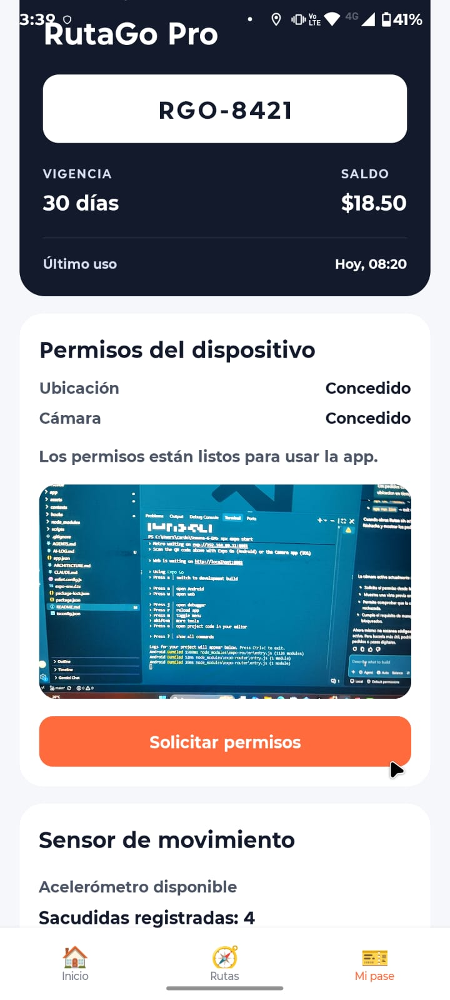 | 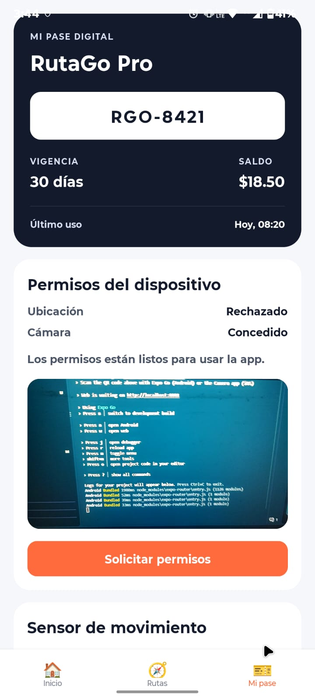 | 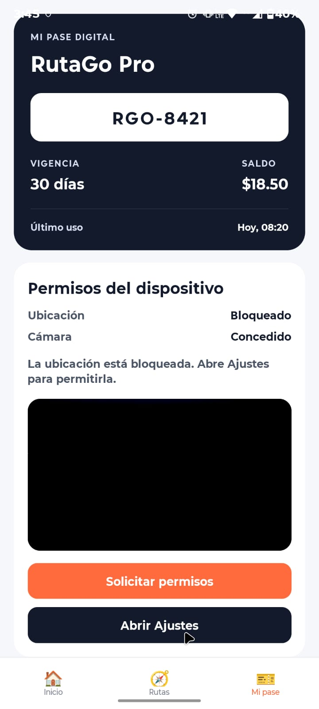 |
| Ubicación y cámara concedidas | Ubicación rechazada, cámara sigue funcionando | Ubicación bloqueada con **Abrir Ajustes** |

### Estados en la pantalla Rutas

| Pendiente | Bloqueado | Concedido |
|:---:|:---:|:---:|
| 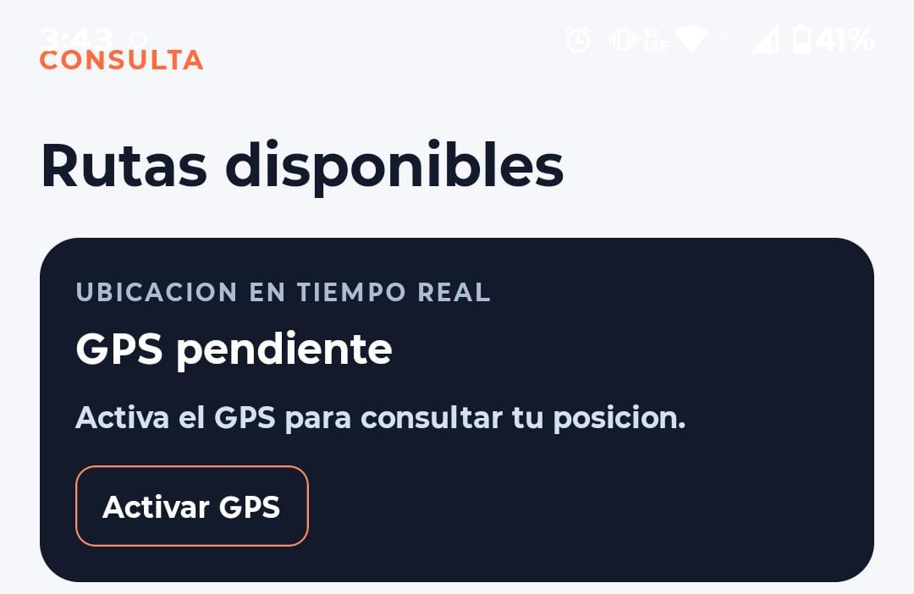 | 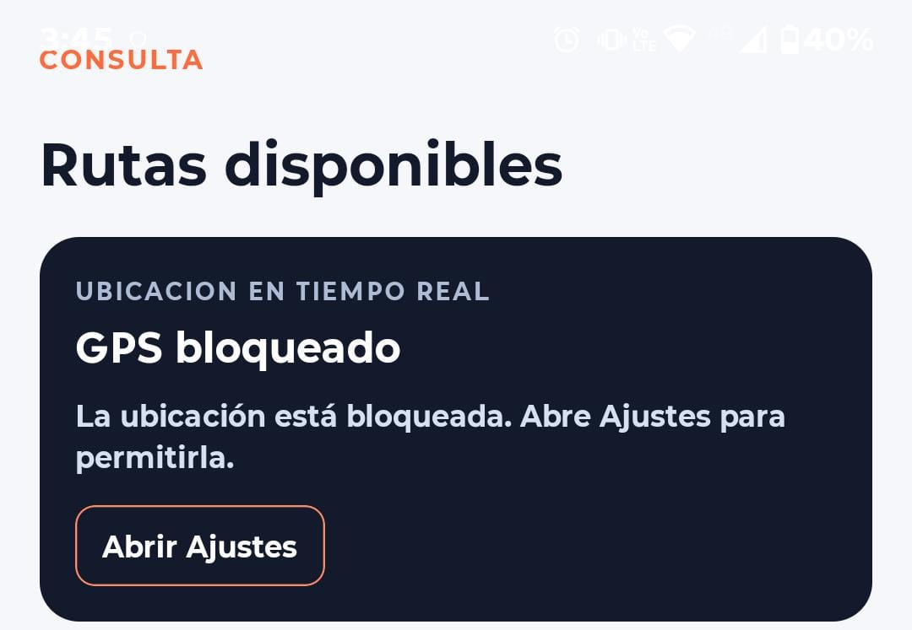 | 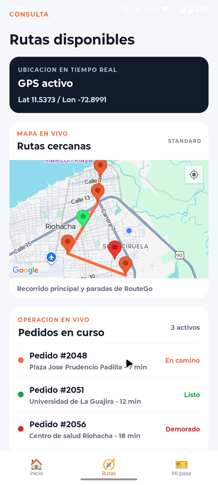 |
| Botón **Activar GPS** | Botón **Abrir Ajustes** | GPS activo con coordenadas |

### Solicitud de permiso en contexto

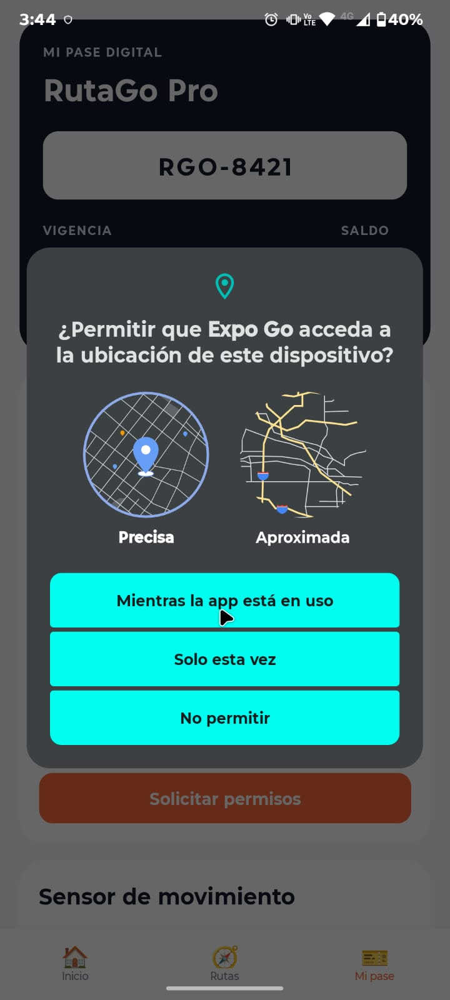

*Diálogo nativo mostrado únicamente tras tocar el botón, nunca al abrir la app.*

### Mapa y pedidos de Riohacha


### Navegación de la app

| Inicio | Listado de rutas | Cámara en Mi pase |
|:---:|:---:|:---:|
| 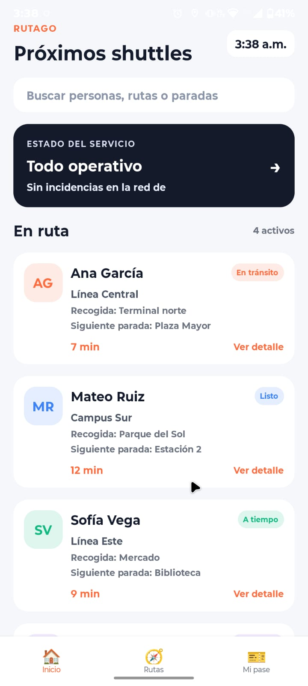 | 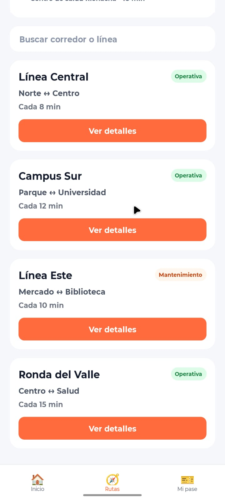 | 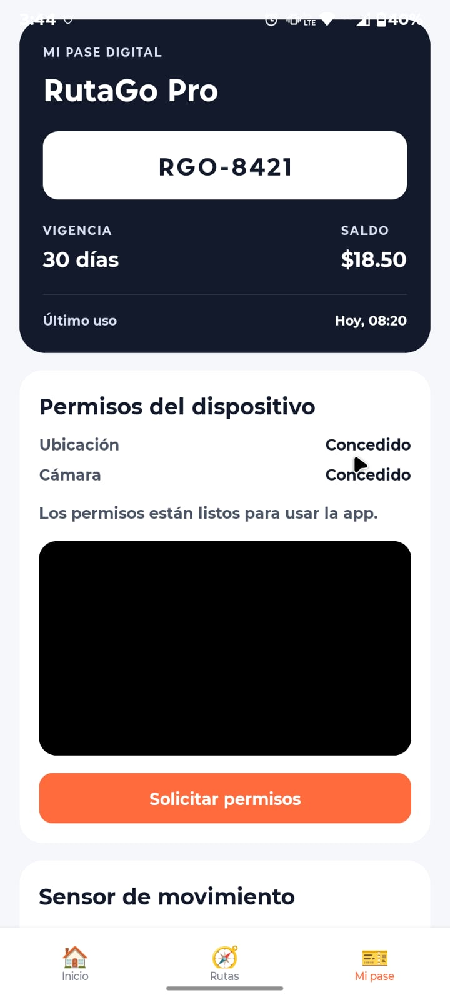 |

### Diagramas de estado de permiso

| Concedido | Rechazado | Bloqueado |
|:---:|:---:|:---:|
| 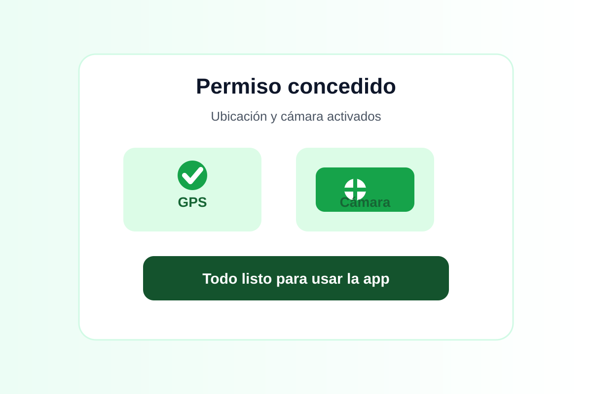 | 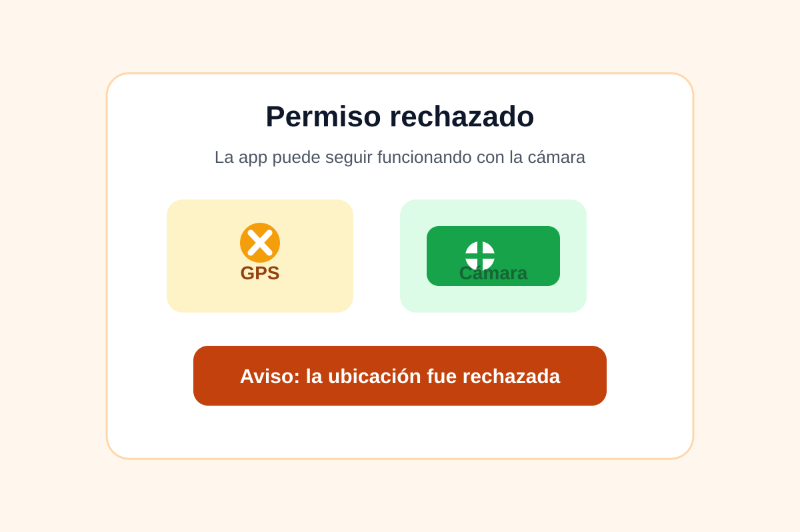 | 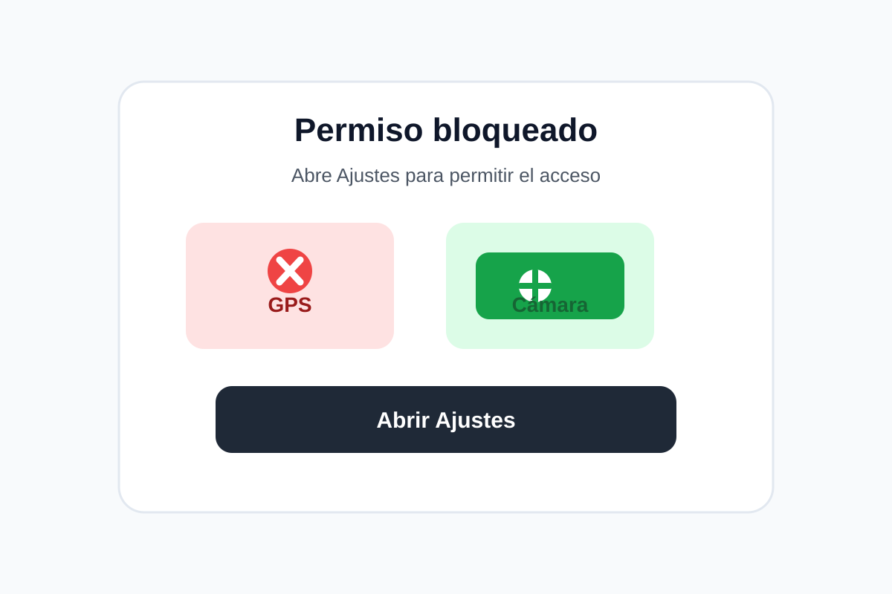 |

---

## ✅ Checklist de verificación

- [x] La app pide permisos **en contexto**, nunca al abrirse.
- [x] Si se niega la ubicación, **la cámara sigue funcionando** y la app lo comunica.
- [x] Existe un botón **"Abrir Ajustes"** cuando el permiso está bloqueado.
- [x] Todas las suscripciones (GPS, acelerómetro) se **limpian al salir** de la pantalla.
- [x] Los hooks están **tipados, sin `any`**, y los errores llegan a la UI como estado.
- [x] `hooks/useGeoLocation.ts`, `hooks/useCamera.ts` y `hooks/useShake.ts` presentes.
- [x] README con capturas de los tres estados de permiso.
- [x] `AI-LOG.md` de la Semana 6 en la raíz.

---

## 🗂️ Estructura del proyecto

```
Semana-6-DM/
├── app/                    # Pantallas (Expo Router)
│   ├── (tabs)/             # Inicio · Rutas · Mi pase
│   └── student/[id]        # Detalle de ruta
├── hooks/
│   ├── useGeoLocation.ts   # GPS + permiso de ubicación
│   ├── useCamera.ts        # Cámara + permiso
│   └── useShake.ts         # Acelerómetro / sacudidas
├── assets/
│   ├── screenshots/        # Capturas de la entrega (1.png – 10.png)
│   └── permission-state/   # granted.svg · denied.svg · blocked.svg
├── AI-LOG.md               # Bitácora de uso de IA (Semana 6)
└── README.md
```

## 🚀 Cómo ejecutar

```bash
npm install
npx expo start
```

1. Instala **Expo Go** compatible con **SDK 54** en un dispositivo físico.
2. Escanea el código QR que aparece en la terminal.
3. Abre **Rutas** para probar el GPS y **Mi pase** para probar cámara, ubicación y acelerómetro.

> ⚠️ GPS, cámara y acelerómetro requieren **dispositivo físico**; los emuladores no los reproducen de forma fiable.

---

## 🛠️ Tecnologías

- Expo SDK 54
- Expo Router
- React Native
- Expo Camera
- Expo Location
- Expo Sensors
- TypeScript (modo estricto)

---

## 🤖 Documentación de IA

El uso de herramientas de IA durante esta semana está documentado en [`AI-LOG.md`](AI-LOG.md), en la raíz del repositorio.
